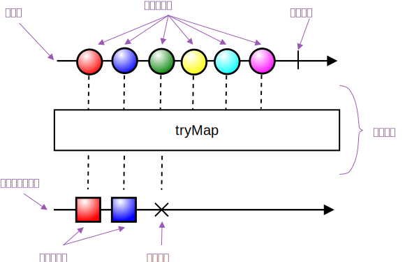

# 简介

在具体介绍 Combine 之前，有两个重要的概念需要简要介绍一下：

* 观察者模式
* 响应式编程

### 观察者模式

观察者模式（Observer Pattern）是一种设计模式，用来描述一对多关系：一个对象发生改变时将自动通知其他对象，其他对象将相应做出反应。这两类对象分别被称为被 **观察目标（Observable）**和 **观察者（Observer）**，也就是说一个观察目标可以对应多个观察者，观察者可以订阅它们感兴趣的内容，当观察目标内容改变时，它会向这些观察者广播通知（调用 Observer 的更新方法）。有一点需要说明的是，观察者之间彼此时互相独立的，也并不知道对方的存在。

在 Swift 中，一个简单的观察者模式可以被描述为：

```swift
protocol Observable {
    associatedtype T: Observer
    mutating func attach(observer: T)
}

protocol Observer {
    associatedtype State
    func notify(_ state: State)
}

struct AnyObservable<T: Observer>: Observable{

    var state: T.State {
        didSet {
            notifyStateChange()
        }
    }

    var observers: [T] = []

    init(_ state: T.State) {
        self.state = state
    }

    mutating func attach(observer: T) {
        observers.append(observer)
        observer.notify(state)
    }

    private func notifyStateChange() {
        for observer in observers {
            observer.notify(state)
        }
    }
}

struct AnyObserver<S>: Observer {

    private let name: String

    init(name: String) {
        self.name = name
    }

    func notify(_ state: S) {
        print("\(name)'s state updated to \(state)")
    }
}

var observable = AnyObservable<AnyObserver<String>>("hello")
let observer = AnyObserver<String>(name: "My Observer")
observable.attach(observer: observer)
observable.state = "world"

// "My Observer's state updated: hello"
// "My Observer's state updated: world"
```

### 响应式编程

响应式编程（Reactive Programming）是一种编程思想，相对应的也有面向过程编程、面向对象编程、函数式编程等等。不同的是，**响应式编程的核心是面向异步数据流和变化的**。

在现在的前端世界中，我们需要处理大量的事件，既有用户的交互，也有不断的网络请求，还有来自系统或者框架的各种通知，因此也无可避免产生纷繁复杂的状态。使用响应式编程后，所有事件将成为异步的数据流，更加方便的是可以对这些数据流可以进行组合变换，最终我们只需要监听所关心的数据流的变化并做出响应即可。

举个有趣的例子来解释一下：

当你早上起床之后，你需要一边洗漱一边烤个面包，最后吃早饭。

传统的编程方法：

```swift
func goodMorning() {
    wake {
        let group = DispatchGroup()
        group.enter()
        wash {
            group.leave()
        }
        group.enter()
        cook {
            group.leave()
        }
        group.notify(queue: .main) {
            eat {
                print("Finished")
            }
        }
    }
}
```

响应式编程：

```swift
func reactiveGoodMorning() {
    let routine = wake.rx.flapLatest {
        return Observable.zip(wash, cook)
    }.flapLatest {
        return eat.rx
    }
    routine.subsribe(onCompleted: {
        print("Finished")
    })
}
```

不同于传统可以看到 wake/wash/cook/eat 这几个事件通过一些组合转换被串联成一个流，我们也只需要订阅这个流就可以在应该响应的时候得到通知。

#### Marble Diagram

为了更方便理解数据流，我们通常用一种叫 Marble Diagram 的图象形式来表示数据流基于时间的变化。



我们用从左至右的箭头表示时间线，不同的形状代表 Publisher 发出的值（Input），竖线代表正常终止，叉代表发生错误而终止。上图中，上面一条时间线是一个数据流，中间的方块代表组合变换，下方的另外一条时间线代表经过变换后的数据流。

