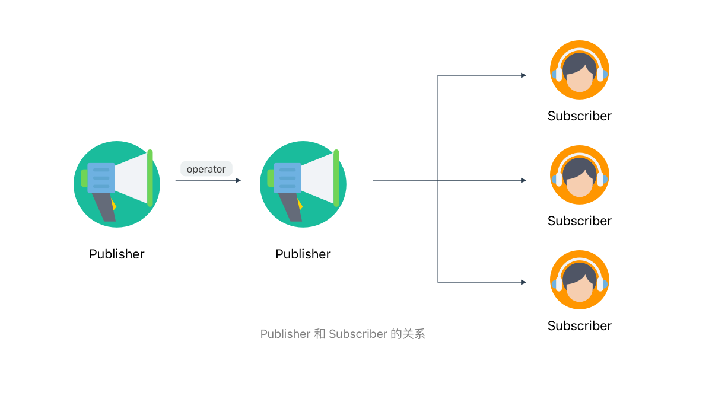
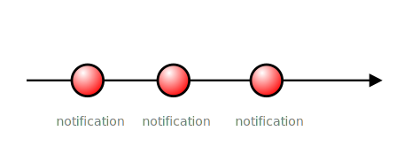
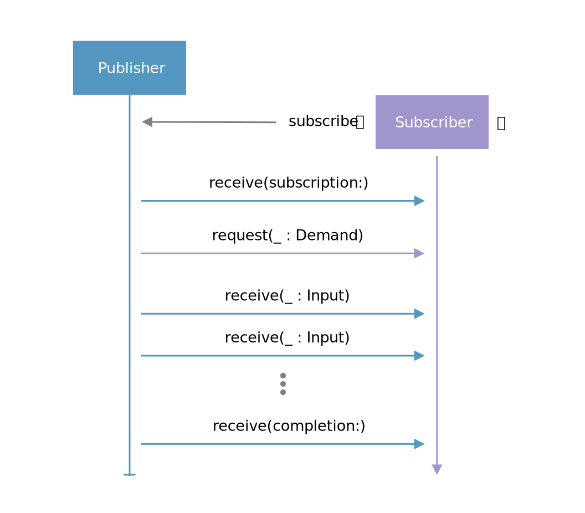

# 简介

在具体介绍 Combine 之前，有两个重要的概念需要简要介绍一下：

* 观察者模式
* 响应式编程

### 观察者模式

观察者模式（Observer Pattern）是一种设计模式，用来描述一对多关系：一个对象发生改变时将自动通知其他对象，其他对象将相应做出反应。这两类对象分别被称为被 **观察目标（Observable）**和 **观察者（Observer）**，也就是说一个观察目标可以对应多个观察者，观察者可以订阅它们感兴趣的内容，当观察目标内容改变时，它会向这些观察者广播通知（调用 Observer 的更新方法）。有一点需要说明的是，观察者之间彼此时互相独立的，也并不知道对方的存在。

在 Swift 中，一个简单的观察者模式可以被描述为：

```swift
protocol Observable {
    associatedtype T: Observer
    mutating func attach(observer: T)
}

protocol Observer {
    associatedtype State
    func notify(_ state: State)
}

struct AnyObservable<T: Observer>: Observable{

    var state: T.State {
        didSet {
            notifyStateChange()
        }
    }

    var observers: [T] = []

    init(_ state: T.State) {
        self.state = state
    }

    mutating func attach(observer: T) {
        observers.append(observer)
        observer.notify(state)
    }

    private func notifyStateChange() {
        for observer in observers {
            observer.notify(state)
        }
    }
}

struct AnyObserver<S>: Observer {

    private let name: String

    init(name: String) {
        self.name = name
    }

    func notify(_ state: S) {
        print("\(name)'s state updated to \(state)")
    }
}

var observable = AnyObservable<AnyObserver<String>>("hello")
let observer = AnyObserver<String>(name: "My Observer")
observable.attach(observer: observer)
observable.state = "world"

// "My Observer's state updated: hello"
// "My Observer's state updated: world"
```

### 响应式编程

响应式编程（Reactive Programming）是一种编程思想，相对应的也有面向过程编程、面向对象编程、函数式编程等等。不同的是，**响应式编程的核心是面向异步数据流和变化的**。

在现在的前端世界中，我们需要处理大量的事件，既有用户的交互，也有不断的网络请求，还有来自系统或者框架的各种通知，因此也无可避免产生纷繁复杂的状态。使用响应式编程后，所有事件将成为异步的数据流，更加方便的是可以对这些数据流可以进行组合变换，最终我们只需要监听所关心的数据流的变化并做出响应即可。

举个有趣的例子来解释一下：

当你早上起床之后，你需要一边洗漱一边烤个面包，最后吃早饭。

传统的编程方法：

```swift
func goodMorning() {
    wake {
        let group = DispatchGroup()
        group.enter()
        wash {
            group.leave()
        }
        group.enter()
        cook {
            group.leave()
        }
        group.notify(queue: .main) {
            eat {
                print("Finished")
            }
        }
    }
}
```

响应式编程：

```swift
func reactiveGoodMorning() {
    let routine = wake.rx.flapLatest {
        return Observable.zip(wash, cook)
    }.flapLatest {
        return eat.rx
    }
    routine.subsribe(onCompleted: {
        print("Finished")
    })
}
```

不同于传统可以看到 wake/wash/cook/eat 这几个事件通过一些组合转换被串联成一个流，我们也只需要订阅这个流就可以在应该响应的时候得到通知。

#### Marble Diagram

为了更方便理解数据流，我们通常用一种叫 Marble Diagram 的图象形式来表示数据流基于时间的变化。


我们用从左至右的箭头表示时间线，不同的形状代表 Publisher 发出的值（Input），竖线代表正常终止，叉代表发生错误而终止。上图中，上面一条时间线是一个数据流，中间的方块代表组合变换，下方的另外一条时间线代表经过变换后的数据流。

### Combine

现在可以进入正题了，什么是 Combine？

官方文档的介绍是：

> The Combine framework provides a declarative Swift API for processing values over time. These values can represent user interface events, network responses, scheduled events, and many other kinds of asynchronous data.
>
> By adopting Combine, you’ll make your code easier to read and maintain, by centralizing your event-processing code and eliminating troublesome techniques like nested closures and convention-based callbacks.

简而言之，Combine 可以使代码更加简洁、易于维护，也免除了饱受诟病的嵌套闭包和回调地狱。Combine 是 Reactive Programming 在 Swift 中的一个实现，更确切的说是对 [ReactiveX \(Reactive Extensions, 简称 Rx\)](https://en.wikipedia.org/wiki/Reactive_extensions) 的实现，而这个实现正是基于观察者模式的。

Combine 是基于泛型实现的，是类型安全的。它可以无缝地接入已有的工程，用来处理现有的 `Target/Action`、`Notification`、`KVO`、`callback/closure` 以及各种异步网络请求。

在 Combine 中，有几个重要的组成部分：

* 发布者：Publiser
* 订阅者：Subscriber
* 操作符：Operator



### Publisher

**在 Combine 中，Publisher 是观察者模式中的 Observable，并且可以通过组合变换（利用 Operator）重新生成新的 Publisher。**

```swift
public protocol Publisher {
    /// The kind of values published by this publisher.
    associatedtype Output

    /// The kind of errors this publisher might publish.
    ///
    /// Use `Never` if this `Publisher` does not publish errors.
    associatedtype Failure : Error

    /// This function is called to attach the specified `Subscriber` to 
    /// this `Publisher` by `subscribe(_:)`
    ///
    /// - SeeAlso: `subscribe(_:)`
    /// - Parameters:
    ///     - subscriber: The subscriber to attach to this `Publisher`.
    ///                   once attached it can begin to receive values.
    func receive<S>(subscriber: S) where S : Subscriber, 
        Self.Failure == S.Failure, Self.Output == S.Input
}
```

在 Publisher 的定义中，`Output` 代表数据流中输出的值，值的更新可能是同步，也可能是异步，`Failure` 代表可能产生的错误，也就是说 Pubslier 最核心的是定义了值与可能的错误。Publisher 通过 `receive(subscriber:)` 用来接受订阅，并且要求 Subscriber 的值和错误类型要一致来保证类型安全。

例如来自官方的一个例子：

```swift
extension NotificationCenter {
        struct Publisher: Combine.Publisher {
                typealias Output = Notification
                typealias Failure = Never
                init(center: NotificationCenter, name: Notification.Name, object: Any? = nil)
        }
}
```

> ~~注意：在 beta 1 中这个 API 尚未开放，并且所有的和 Foundation framework 的集成都没有开放~~
>
> 更新：在 beta 2 中已经支持

这个 Publisher 提供的值就是 Notification 类型，而且永远不会产生错误（`Never`）。这个扩展非常有用，可以很方便地将任何 Notification 转换成 Publisher，便于我们将应用改造成 Reactive。



让我们再看一个的例子：

```swift
let justPubliser = Publishers.Just("Hello")
```

`justPubliser` 会给每个订阅者发送一个 `"Hello"` 消息，然后立即结束（这个数据流只包含一个值）。


### Subscriber

和 Publisher 相对应的，Subscriber 就是观察者模式中 Observer。

```swift
public protocol Subscriber : CustomCombineIdentifierConvertible {
    /// The kind of values this subscriber receives.
    associatedtype Input

    /// The kind of errors this subscriber might receive.
    ///
    /// Use `Never` if this `Subscriber` cannot receive errors.
    associatedtype Failure : Error

    /// Tells the subscriber that it has successfully subscribed to 
    /// the publisher and may request items.
    ///
    /// Use the received `Subscription` to request items from the publisher.
    /// - Parameter subscription: A subscription that represents the connection 
    /// between publisher and subscriber.
    func receive(subscription: Subscription)

    /// Tells the subscriber that the publisher has produced an element.
    ///
    /// - Parameter input: The published element.
    /// - Returns: A `Demand` instance indicating how many more elements 
    /// the subcriber expects to receive.
    func receive(_ input: Self.Input) -> Subscribers.Demand

    /// Tells the subscriber that the publisher has completed publishing, 
    /// either normally or with an error.
    ///
    /// - Parameter completion: A `Completion` case indicating 
    /// whether publishing completed normally or with an error.
    func receive(completion: Subscribers.Completion<Self.Failure>)
}
```

可以看出，从概念上和我们之前定义的简单观察者模式相差无几。Publisher 在自身状态改变时，调用 Subscriber 的三个不同方法（`receive(subscription)`, `receive(_:Input)`, `receive(completion:)`）来通知 Subscriber。



这里也可以看出，Publisher 发出的通知有三种类型：

* Subscription：Subscriber 成功订阅的消息，只会发送一次，取消订阅会调用它的 `Cancel` 方法来释放资源
* Value（Subscriber 的 Input，Publisher 中的 Output）：真正的数据，可能发送 0 次或多次
* Completion：数据流终止的消息，包含两种类型：`.finished` 和 `.failure(Error)`，最多发送一次，一旦发送了终止消息，这个数据流就断开了，当然有的数据流可能永远没有终止

大部分场景下我们主要关心的是后两种消息，即数据流的更新和终止。

Combine 内置的 Subscriber 有三种：

* `Sink`
* `Assign`
* `Subject`

`Sink` 是非常通用的 `Subscriber`，我们可以自由的处理数据流的状态。

例如：

```swift
let once: Publishers.Once<Int, Never> = Publishers.Once(100)
let observer: Subscribers.Sink<Publishers.Once<Int, Never>> = Subscribers.Sink(receiveCompletion: {
    print("completed: \($0)")
}, receiveValue: {
    print("received value: \($0)")
})
once.subscribe(observer)

// received value: 100
// completed: finished
```

Publisher 甚至提供了 `sink(receiveCompletion:, receiveValue:)` 方法来直接订阅。

`Assign` 可以很方便地将接收到的值通过 `KeyPath` 设置到指定的 Class 上（不支持 `Struct`），很适合将已有的程序改造成 Reactive。

例如：

```swift
class Student {
    let name: String
    var score: Int

    init(name: String, score: Int) {
        self.name = name
        self.score = score
    }
}

let student = Student(name: "Jack", score: 90)
print(student.score)
let observer = Subscribers.Assign(object: student, keyPath: \Student.score)
let publisher = PassthroughSubject<Int, Never>()
publisher.subscribe(observer)
publisher.send(91)
print(student.score)
publisher.send(100)
print(student.score)

// 90
// 91
// 100
```

在例子中，一旦 publisher 的值发生改变，相应的，`student` 的 `score` 也会被更新。

`PassthroughSubject` 这里是 Combine 内置的一个 Publisher，可能你会好奇：前面不是说 `Subject` 是一种 Observer 吗，这里怎么又是 Pulisher 呢？

### Subject

有些时候我们想随时在 Publisher 插入值来通知订阅者，在 Rx 中也提供了一个 `Subject` 类型来实现。Subject 通常是一个中间代理，即可以作为 Publisher，也可以作为 Observer。`Subject` 的定义如下：

```swift
public protocol Subject : AnyObject, Publisher {

    /// Sends a value to the subscriber.
    ///
    /// - Parameter value: The value to send.
    func send(_ value: Self.Output)

    /// Sends a completion signal to the subscriber.
    ///
    /// - Parameter completion: A `Completion` instance which indicates 
    /// whether publishing has finished normally or failed with an error.
    func send(completion: Subscribers.Completion<Self.Failure>)
}
```

作为 Observer 的时候，可以通过 Publisher 的 `subscribe(_:Subject)` 方法订阅某个 Publisher。

作为 Publisher 的时候，可以主动通过 `Subject` 的两个 `send` 方法，我们可以在数据流中随时插入数据。目前在 Combine 中，有三个已经实现对 `Subject`: `AnySubject`，`CurrentValueSubject` 和 `PassthroughSubject` 。

利用 Subject 可以很轻松的将现在已有代码的一部分转为 Reactive，一个比较典型的使用场景是：

```swift
// Before
class ContentManager {

    var content: [String] {
        didSet {
            delegate?.contentDidChange(content)
        }
    }

    func getContent() {
        content = ["hello", "world"]
    }
}

// After
class RxContentController {

    var content = CurrentValueSubject<[String], NSError>([])

    func getContent() {
        content.value = ["hello", "world"]
    }
}
```

`CurrentValueSubject` 的功能很简单，就是包含一个初始值，并且会在每次值变化的时候发送一个消息，这个值会被保存，可以很方便的用来替代 Property Observer。在上例中，以前需要实现 delegate 来获取变化，现在只需要订阅 content 的变化即可，并且它作为一个 Publisher，可以很方便的利用操作符进行组合变换。

`PassthroughSubject` 和 `CurrentValueSubject` 几乎一样，只是没有初始值，也不会保存任何值。

### AnyPublisher、AnySubscriber、AnySubject

前面说到 Publisher、Subscriber、Subject 是类型安全的，那么在使用中不同类型的 Publisher、Subscriber、Subject 势必会造成一些麻烦。

考虑下面这种情况：

```swift
class StudentManager {

    let namesPublisher: ??? // what's the type?

    func updateStudentsFromLocal() {
        let student1 = Student(name: "Jack", score: 75)
        let student2 = Student(name: "David", score: 80)
        let student3 = Student(name: "Alice", score: 96)
        let namesPublisher: Publishers.Sequence<[String], Never> = Publishers.Sequence<[Student], Never>(sequence: [student1, student2, student3]).map { $0.name }
        self.namesPublisher = namesPublisher
    }

    func updateStudentsFromNetwork() {
        let namesPublisher: Publishers.Future<[String], Never> = Publishers.Future { promise in
            getStudentsFromNetwork {
                let names: [String] = ....
                promise(.success([names]))
            }
        }
        self.namesPublisher = namesPublisher
    }
}
```

这里 `namesPublisher` 究竟该是什么类型呢？第一个方法返回的是 `Publishers.Sequence<[String], Never>`，第二个方法是 `Publishers.Future<[String], Never>`，而我们是无法定义成 `Publisher<[String], Never>` 的。

`AnyPublisher`、`AnySubscriber`、`AnySubject` 正是为这样的场景设计的，它们是通用类型，任意的 Publisher、Subscriber、Subject 都可以通过 `eraseToAnyPublisher()`、`eraseToAnySubscriber()`、`eraceToAnySubject()` 转化为对应的通用类型。

```swift
class StudentManager {

    let namePublisher: AnyPublisher<[String, Never]>

    func updateStudentsFromLocal() {
        let namePublisher: AnyPublisher<[String, Never]> = Publishers.Sequence<[Student], Never>(sequence: students).map { $0.name }.eraseToAnyPublisher()
        self.namePublisher = namePublisher
    }

    func updateStudentsFromNetwork() {
        let namePublisher: AnyPublisher<[String, Never]> = Publishers.Future { promise in
            promise(.success([names]))
        }.eraseToAnyPublisher()
        self.namePublisher = namePublisher
    }
}
```

`AnyPublisher`、`AnySubscriber`、`AnySubject` 的另外一个实用场景是创建自定义的 Publisher/Subscriber/Subject，因为在框架中它们已经是实现好相应的协议了。

```swift
let justPubliser = AnyPublisher<String, NSError> { subscribe in
    _ = subscribe.receive("hello")  // ignore demand
    subscribe.receive(completion: .finished)
}
let subscriber = AnySubscriber<String, NSError>(receiveValue: { input in
    print("Received input: \(input)")
    return .unlimited
}, receiveCompletion: { completion in
    print("Completed with \(completion)")
})
justPubliser.subscribe(subscriber)

// Received input: hello
// Completed with finished
```

#### Cancellable

让我们回到上文提到的 `Future` 的一个例子：

```swift
let apiRequest = Publishers.Future { promise in
    URLSession.shared.dataTask(with: url) { data, _, _ in
        promise(.success(data))
    }.resume()
}
```

它似乎能够很好的工作，但是一个比较经典的场景是：用户上传某个文件，上传到一半发现选错了就点击取消，我们也应该取消这个上传。类似的还有一些临时生成的资源需要在取消订阅时释放。这在 Combine 中该怎么实现呢？

Combine 中提供了 `Cancellable` 这个协议。定义很简单：

```swift
protocol Cancellable {
    /// Cancel the activity.
    func cancel()
}
```

前面我们提到 Publisher 在被订阅时会给 Subscriber 发送一个 `Subscription` 消息，这个 `Subscription` 恰好也实现了 `Cancellable` 协议，在取消订阅时，会调用它的 `cancel` 方法。

这样，我们就可以实现一个简单的例子：

```swift
let downloadPublisher = Future { promise in
    URLSession.shared.uploadTask(with: request, fromFile: file) { (data, _, _) in
        promise(.success(data)) 
    }.resume()
}
let cancellable = downloadPublisher.sink { data in
    print("Received data: \(data)")
}

// Cancel the task before it finishes
cancellable.cancel()
```

